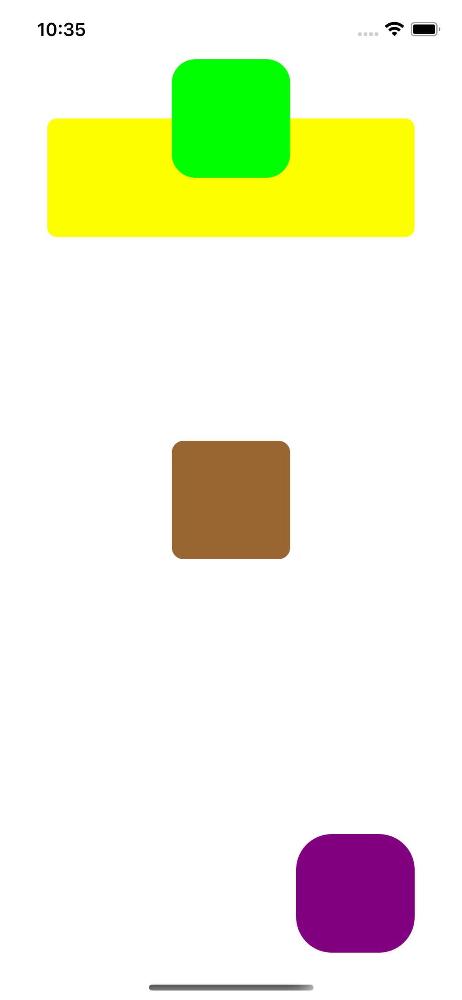
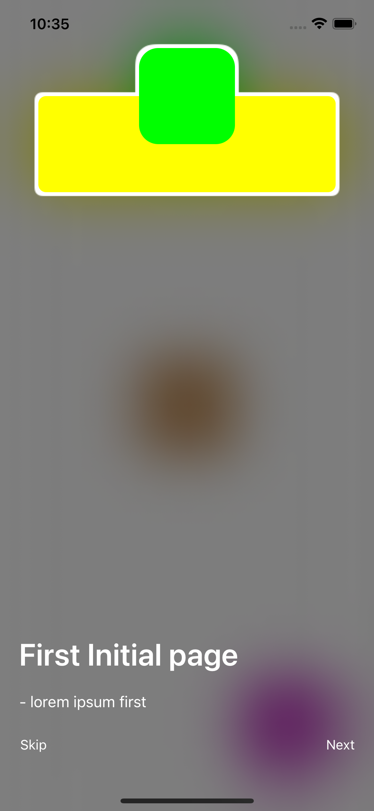
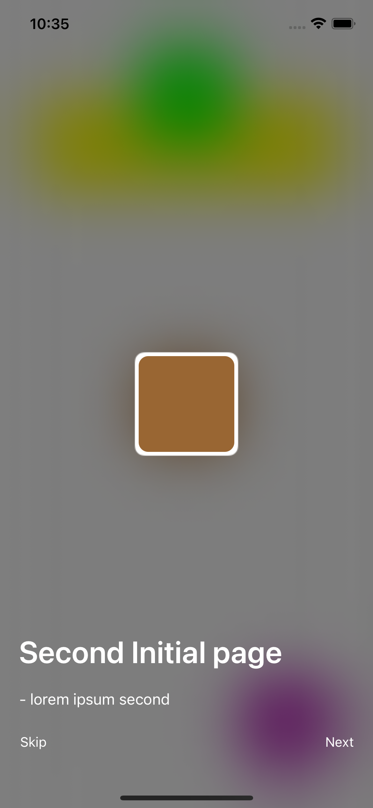
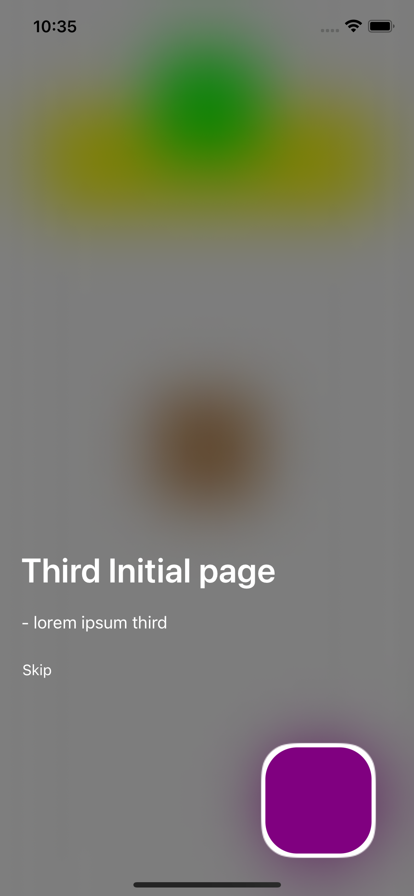

# WalkthroughTutorial






## Installation

BSTableViewReorder is available through [CocoaPods](http://cocoapods.org). To install
it, simply add the following line to your Podfile:

```ruby
pod "WalkthroughTutorial"
```

If you used `use_framework` in your podfile just simply do:

```Swift
import WalkthroughTutorial

```

for every file when you need to use it.

you may also use:

```Swift
@import WalkthroughTutorial

```

within **bridging header** file and avoid to import framework for every needed file.


##Info

- entirely written in latest Swift syntax.

##Usage

```Swift
        let pages = [
            TutorialPage(
                items: [
                    TutorialItem(view: yellowView),
                    TutorialItem(view: greenView),
                ],
                title: "First Initial page",
                description: "- lorem ipsum first"
            ),
            TutorialPage(
                items: [
                    TutorialItem(view: brownView),
                ],
                title: "Second Initial page",
                description: "- lorem ipsum second"
            ),
            TutorialPage(
                items: [
                    TutorialItem(view: purpleView),
                ],
                title: "Third Initial page",
                description: "- lorem ipsum third"
            ),
        ]
        var blurEffect = UIBlurEffect(style: .dark)
        if #available(iOS 13.0, *) {
            blurEffect = UIBlurEffect(style: .systemThinMaterialDark)
        }
        let configuration = TutorialConfiguration(blurEffect: blurEffect)
        let controller = TutorialViewController(pages: pages, configuration: configuration)
        controller.modalPresentationStyle = .overCurrentContext
        present(controller, animated: true)
```

#####Customize the way you work with `WalkthroughTutorial` using `TutorialConfiguration`:

```Swift
public class TutorialConfiguration {
    public var skipButtonTitle = "Skip"
    public var skipButtonColor = UIColor.white
    public var skipButtonFont = UIFont.systemFont(ofSize: 14)
    public var nextButtonTitle = "Next"
    public var nextButtonColor = UIColor.white
    public var nextButtonFont = UIFont.systemFont(ofSize: 14)
    public var titleColor = UIColor.white
    public var descriptionColor = UIColor.white
    public var titleFont = UIFont.boldSystemFont(ofSize: 32)
    public var descriptionFont = UIFont.systemFont(ofSize: 16)
    public var offset: CGFloat = 4
    public let blurEffect: UIBlurEffect
    
    public init(blurEffect: UIBlurEffect) {
        self.blurEffect = blurEffect
    }
}
```


## Author

Bartłomiej Semańczyk, bartekss2@icloud.com

## License

WalkthroughTutorial is available under the MIT license. See the LICENSE file for more info.
